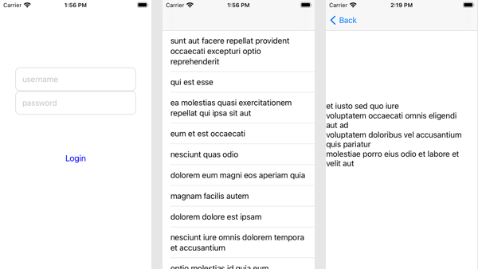
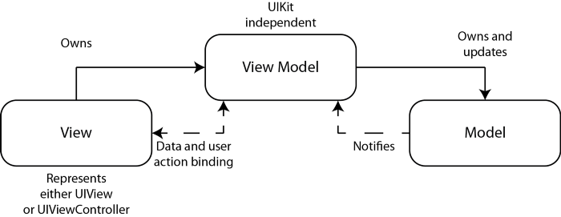
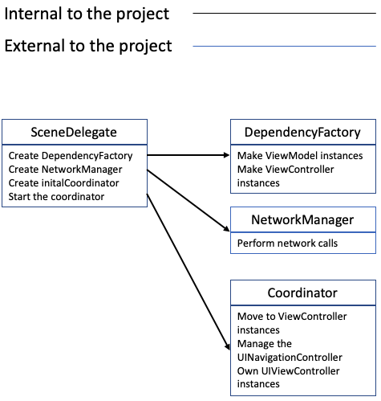

# Flow Coordinators Implemented in Swift
## Handle Dependencies well!


# Before we start
Difficulty: Beginner | Easy | Normal | **Challenging**<br/>
This article has been developed using Xcode 12.2, and Swift 5.3

Requires iOS13 and above for the implementation used to lock the view.
The [Repo is avaliable for download](https://github.com/stevencurtis/SwiftCoding/tree/master/FlowCoordinator/).

## Prerequisites:
* You will be expected to be aware how to make a [Single View Application](https://medium.com/swlh/your-first-ios-application-using-xcode-9983cf6efb71) in Swift.
* I have taken a programmatic approach to the interface, although this is unlikely to trip you up ([the guide is here](https://medium.com/@stevenpcurtis.sc/avoid-storyboards-in-your-apps-8e726df43d2e))
* This article uses [Behaviour View Controllers](https://medium.com/@stevenpcurtis/encode-behaviors-into-reusable-view-controllers-8f6f50e8e82e)
* This article uses my Network Library implementation

## Keywords and Terminology:
Architecture: The base structure of a software development project
UIViewController: A view controller is an intermediary between the views it manages and the data of your app

# This project
## The motivation
I've previously covered the use of [coordinators with MVVM](https://medium.com/@stevenpcurtis.sc/mvvm-c-architecture-with-dependency-injection-testing-3b7197eb2e4d) and while that isn't required reading for this project, having a look at the repo would give you some idea as to the level of this article, and the motivation for writing it.

Although I am proud of that project structure, it can be challenging to keep the coordinators in sync with the view controller hierarchy

This article is intended to leverage the `MVVM-C` architecture, and also provide a sample as to how the solution might be tested! 

## The frameworks used
In order to keep this article, and the code as readable as possible I've used my own [Network Library](https://stevenpcurtis.medium.com/write-a-network-layer-in-swift-388fbb5d9497) and [Two Way Binding Library](https://stevenpcurtis.medium.com/implement-two-way-uikit-binding-in-vanilla-swift-5261d15c918), and the links shown here allow you to look at my detailed explaination in those articles.

## The idea
The project here has a login screen (which you'll need the username-password combination of eve.holt@reqres.in-cityslicka (provided by `https://reqres.in/api/login`) and once logged in there is a `UITableView` instance holding the data from `https://jsonplaceholder.typicode.com/posts` and then a detail view that shows the same `String`. 

The example diagram is shown here:


Where we transition from the left-hand view controller to the right-hand side of the diagram. The `UIViewController` instances are called `LoginViewController`, `ToDoListViewController` and `DetailViewController` (in order from the diagram).

Since the project implements MVVM two-way binding has been implemented, and the data is stored in the ViewModel for each of these `UIViewController` instances which are called `LoginViewModel`, `ToDoViewModel` and `DetailViewModel` (again in order).



## Concepts
Encode Behaviors into Reusable View Controllers
[Dependency injection](https://medium.com/@stevenpcurtis.sc/learning-dependency-injection-using-swift-c94183742187)
Data Binding using my [Two Way Binding Library](https://stevenpcurtis.medium.com/implement-two-way-uikit-binding-in-vanilla-swift-5261d15c918) avoiding the use of third-party libraries
[Key Chain](https://medium.com/@stevenpcurtis.sc/secure-user-data-with-keychain-in-swift-337684d6488c)
URLs are build using my [URL Builder](https://medium.com/swlh/building-urls-in-swift-51f21240c537)
The views here are [programatically created](https://medium.com/@stevenpcurtis.sc/write-clean-code-by-overriding-loadview-ac4f172163d0).

## Using the project
If you want to download the project from the [Repo](https://github.com/stevencurtis/SwiftCoding/tree/master/FlowCoordinator/) to get all of the code, you are welcome to. However since the login server is provided by `https://reqres.in/api/login` to log in you  need to use a *username* of eve.holt@reqres.in, and a *password* of cityslicka.

## Limitations
The token is stored from the login, and then is not used for future API requests. This is a function of using free API calls, and if you were to replace the API calls used it would be possible to retreive it using `UserDataManager().token` / `keychain.token`and then use it in the client API for `AnyNetworkManager`.

I'm using a programmatic way of creating the `UIViewController` instances, and have not attempted to demonstrate how to use a `UIStoryboard` in this project, although an approach from [this article covering MVVM Dependency Injection using Storyboards](Dependency Injection using Storyboards) could be adapted.

This is a demo project, and does not even attempt to obtain 100% test coverage, rather it covers the majority of areas and how they *might* be tested through a variety of test strategies.

# Of note in the Implementation
## The Errors
In relevant view models we have an `errorBindable` defined as:
```swift
var errorBindable: MakeBindable<Error> = MakeBindable()
```

which is observed from the relevant `UIViewController` instance to a property, and the `UIAlertView` is opened from there.
```swift
viewModel.errorBindable.bind(\Error.self, to: self, \.myError)
 
var myError: Error? {
    didSet {
        self.showNotification(title: "An error occured", message: "\(myError!.localizedDescription)", completion: nil)
    }
}
```
This calls an extension that allows for a completion handler to communicate back to the `UIViewController` instance that the user has finished with the `UIAlertController`.

```swift
extension UIViewController {
    func showNotification(title: String, message: String, completion: (() -> Void)?) {
        let alertController = UIAlertController(title: title, message: message, preferredStyle: .alert)
        let okAction: UIAlertAction = UIAlertAction.init(title: "OK", style: .default) { (_) in
            guard let completion = completion else {return}
            completion()
        }

        alertController.addAction(okAction)
        present(alertController, animated: true, completion: nil)
    }
}
```

## Initializers
In terms of dependency injection, a good use of initializers in the view model instances mean that the network manager and keychain manager can be used, and swapped out for mocks during testing (providing the mocks conform to `NetworkManagerProtocol` and `UserDataManagerProtocol` respectively. 

```swift
init<T: NetworkManagerProtocol>(networkManager: T, keychain: UserDataManagerProtocol = UserDataManager() ) {
    self.anyNetworkManager = AnyNetworkManager(manager: networkManager)
    self.keychain = keychain
}
```

Then within tests a Mock can be used and injected using something like the following:

```swift
var loginViewModel: LoginViewModel?
var networkManager: MockNetworkManager<URLSession>?
loginViewModel = LoginViewModel(networkManager: networkManager!)
```

## A sample UIViewController and accompanying view model
The login process is split between `LoginViewController` and `LoginViewModel`, as detailled here:
```swift
class LoginViewController: UIViewController {
    private var viewModel: LoginViewModel!
    let usernameTextField = UITextField(frame: .zero)
    let passwordTextField = UITextField(frame: .zero)
    
    private var coordinator: ProjectCoordinator?
    
    override func viewDidLoad() {
        super.viewDidLoad()
        setupBehaviours()
        bind(to: viewModel)
    }
    
    override func viewDidAppear(_ animated: Bool) {
        super.viewDidAppear(animated)
    }

    var traverse: Bool? {
        didSet {
             coordinator?.moveToList()
        }
    }
    
    var myError: Error? {
        didSet {
            viewModel.cancelCall()
            self.showNotification(title: "An error occured", message: "\(myError!.localizedDescription)", completion: nil)
        }
    }
    
    lazy var loginButton: UIButton = {
        let butt = UIButton(frame: .zero)
        butt.setTitle("Login", for: .normal)
        butt.setTitleColor(.blue, for: .normal)
        butt.setTitleColor(.gray, for: .disabled)
        butt.translatesAutoresizingMaskIntoConstraints = false
        butt.addTarget(self, action: #selector(self.loginAction), for: .touchDown)
        return butt
    }()
    
    lazy var controlsStack: UIStackView = {
        let stack = UIStackView(frame: .zero)
        stack.translatesAutoresizingMaskIntoConstraints = false
        stack.distribution = .fillProportionally
        stack.axis = .vertical
        return stack
    }()
    
    @objc func loginAction() {
        viewModel.loginNetworkCall()
    }

    override func loadView() {
        let view = UIView()
        view.backgroundColor = .white
        self.view = view
        
        self.view.addSubview(controlsStack)
        
        usernameTextField.backgroundColor = .white
        usernameTextField.layer.cornerRadius = 10
        usernameTextField.layer.borderColor = UIColor.systemGray4.cgColor
        usernameTextField.layer.borderWidth = 1.0
        usernameTextField.placeholder = "username"
        usernameTextField.autocapitalizationType = .none
        usernameTextField.spellCheckingType = .no
        usernameTextField.leftView = UIView(frame: CGRect(x: 0, y: 0, width: 15, height: usernameTextField.frame.height))
        usernameTextField.leftViewMode = .always
        
        usernameTextField.translatesAutoresizingMaskIntoConstraints = false
        controlsStack.addArrangedSubview(usernameTextField)
        
        passwordTextField.backgroundColor = .white
        passwordTextField.layer.cornerRadius = 10
        passwordTextField.layer.borderColor = UIColor.systemGray4.cgColor
        passwordTextField.layer.borderWidth = 1.0
        passwordTextField.placeholder = "password"
        passwordTextField.autocapitalizationType = .none
        passwordTextField.spellCheckingType = .no
        passwordTextField.leftView = UIView(frame: CGRect(x: 0, y: 0, width: 15, height: passwordTextField.frame.height))
        passwordTextField.leftViewMode = .always
        passwordTextField.translatesAutoresizingMaskIntoConstraints = false

        controlsStack.addArrangedSubview(passwordTextField)
        controlsStack.addArrangedSubview(loginButton)
        
        NSLayoutConstraint.activate([
            usernameTextField.heightAnchor.constraint(equalToConstant: 50),
            passwordTextField.heightAnchor.constraint(equalToConstant: 50),
            controlsStack.centerYAnchor.constraint(equalTo: self.view.centerYAnchor),
            controlsStack.centerXAnchor.constraint(equalTo: self.view.centerXAnchor),
            controlsStack.heightAnchor.constraint(equalTo: self.view.heightAnchor, multiplier: 0.5),
            controlsStack.widthAnchor.constraint(equalTo: self.view.widthAnchor, multiplier: 0.8)
        ])
    }
    
    init(coordinator: ProjectCoordinator, viewModel: LoginViewModel) {
        self.coordinator = coordinator
        self.viewModel = viewModel
        super.init(nibName: nil, bundle: nil)
    }

    required init?(coder: NSCoder) {
        fatalError("init(coder:) has not been implemented")
    }

    private func bind(to viewModel: LoginViewModel) {
        viewModel.userNameBindable.bind(\String.self, to: usernameTextField, \.text)
        viewModel.passwordBindable.bind(\String.self, to: passwordTextField, \.text)
        viewModel.errorBindable.bind(\Error.self, to: self, \.myError)
        viewModel.loginBindable.bind(\Bool.self, to: self, \.traverse)
        viewModel.viewEnabledBindable.bind(\Bool.self, to: loginButton, \.isEnabled)
        viewModel.viewEnabledBindable.bind(\Bool.self, to: self, \.loading)
    }
    
    var loading: Bool? {
        didSet {
            if let loading = loading, !loading {
                UIApplication.shared.windows.filter {$0.isKeyWindow}.first?.startIndicatingActivity()
            } else {
                UIApplication.shared.windows.filter {$0.isKeyWindow}.first?.stopIndicatingActivity()
            }
        }
    }
    
    private func setupBehaviours() {
        addBehaviors([HideNavigationBarBehavior()])
    }
}
```

Whereas the `LoginViewModel` makes the network request, and is bound to the `UIViewController` instance:

```swift
import Foundation
import NetworkLibrary
import TwoWayBindingUIKit

class LoginViewModel {
    var userNameBindable: MakeBindable<String> = MakeBindable() // "eve.holt@reqres.in"
    var passwordBindable: MakeBindable<String> = MakeBindable() // "cityslicka"
    var errorBindable: MakeBindable<Error> = MakeBindable()
    var loginBindable: MakeBindable<Bool> = MakeBindable()
    var viewEnabledBindable: MakeBindable<Bool> = MakeBindable()

    private var anyNetworkManager: AnyNetworkManager<URLSession>
    private var keychain: UserDataManagerProtocol

    init<T: NetworkManagerProtocol>(networkManager: T, keychain: UserDataManagerProtocol = UserDataManager() ) {
        self.anyNetworkManager = AnyNetworkManager(manager: networkManager)
        self.keychain = keychain
    }
    
    func cancelCall() {
        anyNetworkManager.cancel()
    }
    
    func loginNetworkCall() {
        viewEnabledBindable.update(with: false)
        guard let userName = userNameBindable.currentValue(),
              let password = passwordBindable.currentValue()
        else { self.viewEnabledBindable.update(with: true); return }
        let data: [String : Any] = ["email": userName, "password": password]
        anyNetworkManager.fetch(url: API.login.url, method: .post(body: data), completionBlock: {[weak self] res in
            switch res {
            case .success(let data):
                let decoder = JSONDecoder()
                if let decoded = try? decoder.decode(Login.self, from: data) {
                    self?.keychain.token = decoded.token
                    self?.loginBindable.update(with: true)
                } else {
                    self?.errorBindable.update(with: ErrorModel(errorDescription: "Could not decode JSON"))
                }
                self?.viewEnabledBindable.update(with: true)

            case .failure(let error):
                self?.errorBindable.update(with: error)
                self?.viewEnabledBindable.update(with: true)
            }
        })
    }
}
```
## The structure of the ProjectCoordinator
The project coordinator is described through the following project:

 

# Conclusion
Flow Coordinators are a great way to prevent the classing "massive view controller" that we have all read about, while making sure that we have full functionality to aid understanding. 

Remember you can download the [Repo](https://github.com/stevencurtis/SwiftCoding/tree/master/FlowCoordinator/) to get all of the code and, hopefully find this project useful for whatever you are doing in your coding journey.

Whatever you do with this project, and your time coding remember to do please enjoy it!

If you've any questions, comments or suggestions please hit me up on [Twitter](https://twitter.com/stevenpcurtis) 
